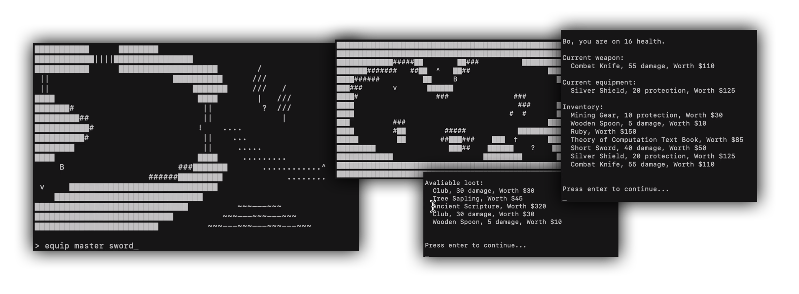

# Haskell Text Based Adventure Game
Top down 2D text based adventure game made in vanilla Haskell and System IO module.



## Installation
1. Initiate GHCi: ```stack gchi```
2. Load file: ```:l main.hs```
3. Start game: ```main```

This program is combatible with any Haskell compiler. Note that System IO is required to be installed (by default, GHCi has).

## Objective
The objective of the game is to navigate through a series of levels to get to the finish. There are 5 levels is required to go through to complete the game. The end game focuses not only on actually defeating the bosses, but also the cumulative worth of the items they managed to escape with. For instance, collecting 10 items worth $20 each will give the user a score of 200 at the end of the game.

## Commands
- **attack** - inflict damage to the boss the player is fighting
- **inventory** - lists all items in the player’s inventory including the name, worth and item damage or protection.
- **pick up (item name)** - when the player is standing on the stash, the pick up command will transfer the item from the stash to the player’s inventory
- **drop (item name)** - when the player is standing on the stash, the drop command will transfer the item from the player’s inventory to the stash.
- **examine** - when the player is standing on a stash, the console will show all of the items with their name, worth and item damage or production.
- **sleep** - heal a player to full HP
- **equip (item name)** - makes the item in question the current weapon and equipment of the player.
- **help** - lists all commands available to the user with notes on what the objective is and notes detailing the consensus of the game.
- **quit** - exit the game

## Notes
- Movement is done with the W, A, S, and D keys.
- To initiate a command, press forward slash, i.e. /
- The player cannot drop an item they are currently using as a weapon or equipment.
- The user use variations of the commands for the same action. The user can type “take” instead of “pick up”, etc. and also include some connectors, e.g. “the” in the command “pick up the short sword”
- When looking at the inventory, all items are listed. However, at the top, the weapon and equipment are noted so they user known what they currently have equipped.
- When equipping, the game will know if the item to equip will be the weapon or equipment because of the nature of the item, i.e. the item “short sword” will be equipped as the weapon as primarily it is used to inflict damage. Not all items are equip-able, e.g. a book or ruby cannot be a weapon or equipment.
- If you try and equip or drop and item you don’t have, you will be prompt that you don’t own that item.

## License
See LICENSE.md for more information.
